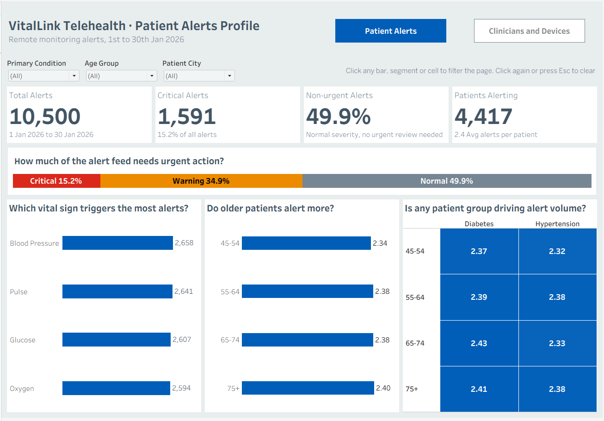
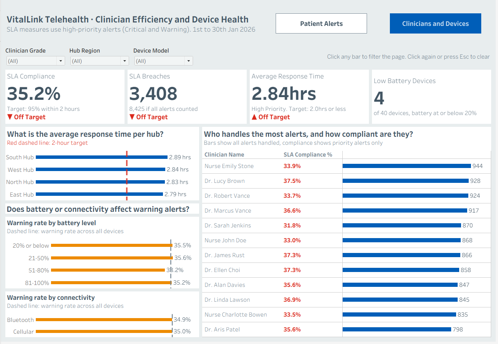

# VitalLink Telehealth: Alarm Fatigue and SLA Performance (Tableau)

A two-page interactive Tableau dashboard analysing 10,500 remote patient monitoring alerts over 30 days, built as my capstone for the 10Alytics HealthTech Analytics Programme. This is my first Tableau dashboard, having previously worked in Power BI.

**Live dashboard:** [View on Tableau Public](https://public.tableau.com/app/profile/samuel2755/viz/Tableaucapstoneproject_17908182801300/Page1PatientAlerts?publish=yes)

## The business problem

VitalLink Telehealth monitors patients with diabetes and hypertension at home. Its Clinical Operations Board faced three problems:

1. **Alarm fatigue:** critical and routine alerts arrive in one feed, desensitising clinical staff.
2. **SLA blind spots:** no visibility of which hubs and clinicians miss the 2-hour review target for high-priority alerts.
3. **Device doubts:** a suspicion that old devices or low batteries generate false warning alerts.

## Data

Star schema in Excel: one fact table (10,500 alerts) and three dimensions (5,000 patients, 12 clinicians, 40 devices). Profiling found no nulls, duplicates or orphan keys, so no cleaning was required.

## Approach

- Related the fact table to three dimensions using Tableau relationships (many-to-one, full referential integrity)
- Built 25+ calculated fields, organised into folders: response-time and 2-hour compliance flags, age groups, KPI measures, status logic and a battery threshold parameter
- Designed 8 KPI cards with conditional status badges (On Target, At Risk, Off Target) that recalculate under every filter
- Added dropdown filters scoped to each page and click-to-filter dashboard actions on every chart
- Applied the NHS colour palette, removed chart junk and used question-style chart titles

### Key analytical decisions

| Decision | Reason |
|---|---|
| SLA applies to Critical and Warning alerts | The brief sets the 2-hour target for high-priority alerts but never defines them |
| 95% compliance target | The brief sets a deadline but no percentage; 95% is a common healthcare benchmark |
| Alerts per patient, not raw counts | Removes the distortion of different group sizes |
| Heatmap colour scale starts at zero | Prevents tiny differences (2.32 vs 2.43) looking dramatic |
| Low battery threshold as a parameter | Turns an assumption into a slider the user controls |

## Key findings

| Area | Finding |
|---|---|
| Alert mix | 49.9% of alerts are Normal severity; only 15.2% are Critical |
| Vital signs | All four vital signs are within 64 alerts of each other |
| Patients | Every age group and condition alerts at 2.32 to 2.43 alerts per patient |
| SLA | 35.2% compliance against a 95% target; 3,408 breaches |
| Critical alerts | Average 1.82 hours (under target), yet 45.8% still breach |
| Hubs | All four average 2.79 to 2.89 hours, all above target |
| Clinicians | All 12 sit between 31.8% and 37.5% compliance; workload does not explain it |
| Devices | Warning rates are flat across battery levels and connectivity (about 35%) |

**Headline:** the problem is the system, not any team, patient group or device.

## Recommendations

1. Separate the alert queues: route Critical alerts to a priority queue and batch Normal alerts
2. Review alert thresholds system-wide
3. Auto-escalate critical alerts not reviewed within 90 minutes
4. Fix process, not people: no hub or clinician is an outlier
5. Do not fund hardware replacement on the false-warning theory; log battery level at alert time instead

## Limitations

- A single 30-day period, so no trends or seasonality
- One battery reading per device, not at the time of each alert
- 40 devices shared across 5,000 patients, unlike real remote monitoring
- Very even distributions suggest a simulated dataset, so findings are illustrative of the method rather than real-world conclusions

## Files

- `VitalLink_Tableau_Capstone.pdf`: submitted slide deck with charts, business questions, findings and recommendations
- `images/`: dashboard screenshots

## Tools

Tableau Public · Excel

## What I learned

- Tableau relationships versus joins, and when each applies
- Row-level versus aggregate calculations, and how nulls behave in averages and counts
- Building conditional KPI badges that stay correct under any filter
- Container-based dashboard layout with tiled objects
- Avoiding misleading visuals, such as colour scales that exaggerate small differences

## Skills demonstrated

Data modelling (star schema, relationships) · calculated fields and parameters · KPI design with conditional formatting · dashboard actions and filter scoping · data storytelling · honest handling of ambiguous requirements
